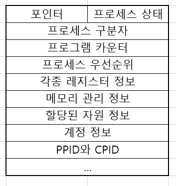

# 3-2 프로세스 제어 블록과 문맥 교환

## 1. 프로세스 제어 블록 (Process Control Block)
    * == TCB (Task Control Block)
    * 프로세스를 실행하는데 필요한 중요한 정보를 보관하는 자료구조
    * 모든 프로세스는 고유한 프로세스 제어 블록을 가짐
    * PCB는 프로세스 생성 시 만들어지고, 프로세스가 종료되면 폐기됨
    * 프로세스 제어 블록의 구성
### 1.1 프로세스 제어 블록의 구성

    * 포인터 
        - 프로세스 제어 블록을 연결하여 준비 상태나 대기 상태의 큐를 구현할 때 사용
    * 프로세스 상태
        - 프로세스 상태에는 생성, 준비, 실행, 대기, 보류 준비, 보류 대기 등이 있음
        - 프로세스가 현재 어느 상태에 있는지 나타냄
    * 프로세스 구분자
        - 운영체제 내에 있는 여러 프로세스를 구별하기 위한 구분자를 저장
    * 프로그램 카운터
        - 다음에 실행될 명령어의 위치를 가리키는 값을 저장
    * 프로세스 우선 순위
        - 우선순위에 따라 PCB들이 여러 줄로 서 있음
        - CPU 스케쥴러가 프로세스 우선 순위를 기준으로 준비 상태에 있는 프로세스 중 실행 상태로 옮길 프로세스를 선택
        - 높은 우선 순위의 프로세스가 낮은 순위 보다 더 자주 실행 됨
    * 각종 레지스터 정보
        - 프로세스가 실행 되는 중 사용하던 레지스터의 값이 저장
        - 이전 실행에 사용한 레지스터의 값을 저장해야 다음에 실행할 수 있음
    * 메모리 관리 정보
        - 프로세스가 메모리의 어디에 있는지 나타내는 메모리 위치 정보, 메모리 보호를 위해 사용하는 경계 레지스터 값과 한계 레지스터 값 등이 저장
        - 그 외에 세그먼테이션 테이블, 페이지 테이블 등의 정보도 들어감
    * 할당된 자원 정보
        - 프로세스를 실행하기 위해 사용하는 입출력 자원이나 오픈 파일 등에 대한 정보
    * 계정 정보
        - 계정 번호, CPU 할당 시간, CPU 사용 시간 등
    * 부모 프로세스 구분자(PPID)와 자식 프로세스 구분자(CPID)
        - 프로세스를 이해하는 데 매우 중요한 열쇠인 부모-자식 프로세스 관계는 3절에서 설명...
### 1.2 포인터 역할
    * 포인터는 PCB의 가장 위에 있음
    * 프로세스 제어 블록을 연결하여 준비 상태나 대기 상태의 큐를 구현할 때 사용
    * 대기 상태에는 같은 입출력을 요구하는 프로세스끼리 모아 둠
    * 대기 상태에서 같은 입출력을 기다리는 프로세스의 PCB 는 동일한 입출력 큐에 모여 있는데 이를 대기 큐라고 함
    * 대기 큐 -> 완료 인터럽트 도착 -> 해당 PCB의 상태를 준비 상태로 바꿈 -> 대기 큐에서 제거 -> 준비 큐로 이동

## 2. 문맥 교환 (Context Switching)
### 2.1 문맥 교환의 의미
    * CPU를 차지하던 프로세스가 나가고 새로운 프로세스를 받아들이는 작업
### 2.2 문맥 교환 절차
    * 실행 상태에서 나가는 PCB는 지금까지의 내용을 저장하고 프로세스는 준비 상태가 됨
    * 실행 상태로 들어오는 PCB의 내용으로 CPU 세팅
    * 문맥 교환이 일어는 이유
        - 프로세스가 자신에게 주어진 시간을 모두 사용
        - 인터럽트 발생

