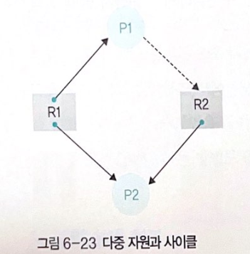
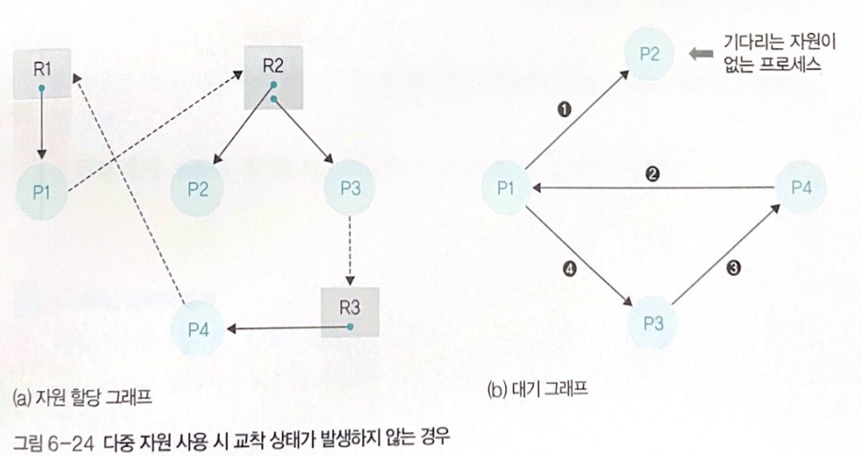
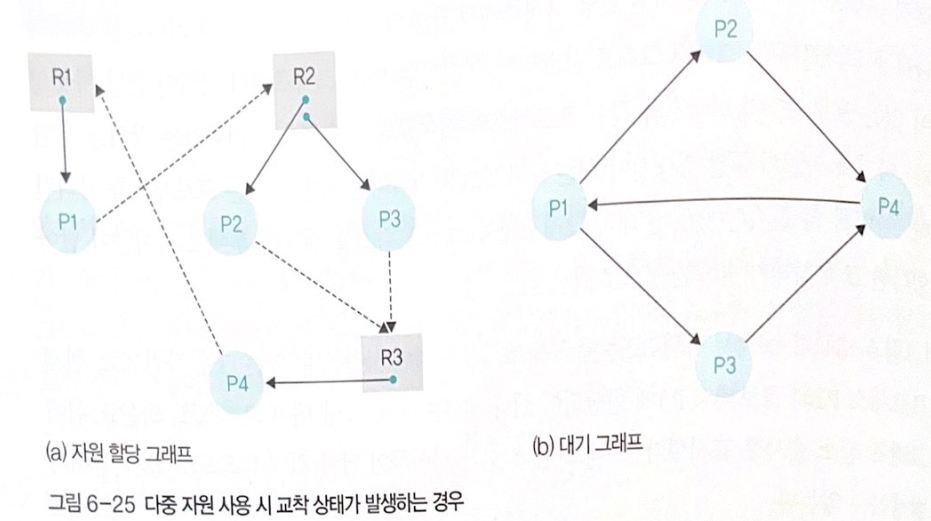

# 04 [심화학습] 다중 자원과 교착 상태 검출

## 1. 다중 자원과 사이클

    * R1은 두 프로세스가 동시에 사용할 수 있는 다중 자원
    * P1은 R1을 사용하면서 R2를 기다리고, P2는 R1과 R2를 동시에 사용 중
    * 언뜻 보면 사이클이어서 교착 상태 같지만, P2가 작업을 마친 후 P1이 R2를 사용하여 작업을 마칠 수 있기 때문에 교착상태가 아님
    * 다중 자원이 포함된 자원 할당 그래프에서는 대기 그래프와 그래프 감소 방법을 이용하여 사이클을 찾음

## 2. 대기 그래프(wait for graph)와 그래프 감소(graph reduction)
    * 대기 그래프 
        - 자원 할당 그래프에서 프로세스와 프로세스 간에 기다리는 관계만 나타낸 그래프
    * 그래프 감소 
        - 대기 그래프에서 작업이 끝날 가능성이 있는 프로세스의 화살표와 관련 프로세스의 화살표를 연속적으로 지워가는 작업
        - 작업이 끝날 가능성이 있는 프로세스란 기다리는 자원이 없는 프로세스를 의미
    * 다중 지원이 있는 대기 그래프에서 그래프 감소를 완료한 후에도 사이클이 남아 있다면 교착 상태가 발생한 것으로 판단

    * 기다리는 자원이 없는 P2에 대해 P1에서 P2로 가는 화살표를 지움
    * P1이 작업을 종료할 수 있으니 P4에서 P1로 가는 화살표를 지움 
    * P1이 작업을 종료할 수 있으니 P4에서 P1로 가는 화살표를 지움
    * P4이 작업을 종료할 수 있으니 P3에서 P4로 가는 화살표를 지움
    * P3이 작업을 종료할 수 있으니 P1에서 P3로 가는 화살표를 지움
    * 그래프 감소 결과 사이클이 남아 있지 않으므로 교착 상태가 발생하지 않음

    
    * 작업이 끝날 수 있는 (기다리는 자원이 없는) 프로세스가 존재하지 않아 교착 상태 발생
